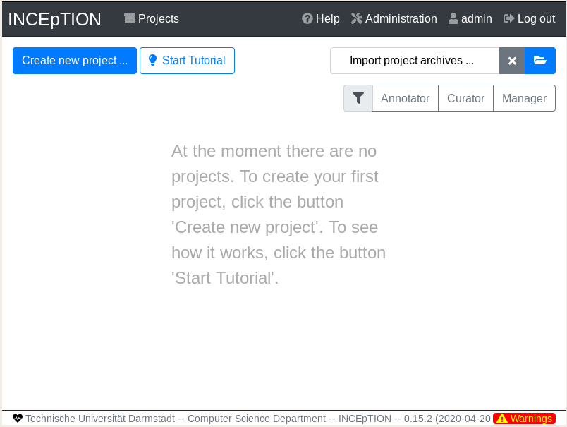

# inception
Plataforma de anotação semântica que oferece assistência inteligente e gerenciamento de conhecimento

O arquivo contém a versão 0.15.2 do Inception instalada para testes em uma máquina virtual em forma de Appliance.

Link para o arquivo: https://drive.google.com/open?id=1KG5H0r6EKAeYvtsN88T3E7uIQhk8lyVY

Basta importar o arquivo para o virtual box e o Tomcat já estará configurado como serviço rodando na porta 8080

O login do sistema é "giorgio" com a senha "giorgio"

As credenciais para acesso ao banco de dados são:

database.username=inception
database.password=t0t4llYSecreT

